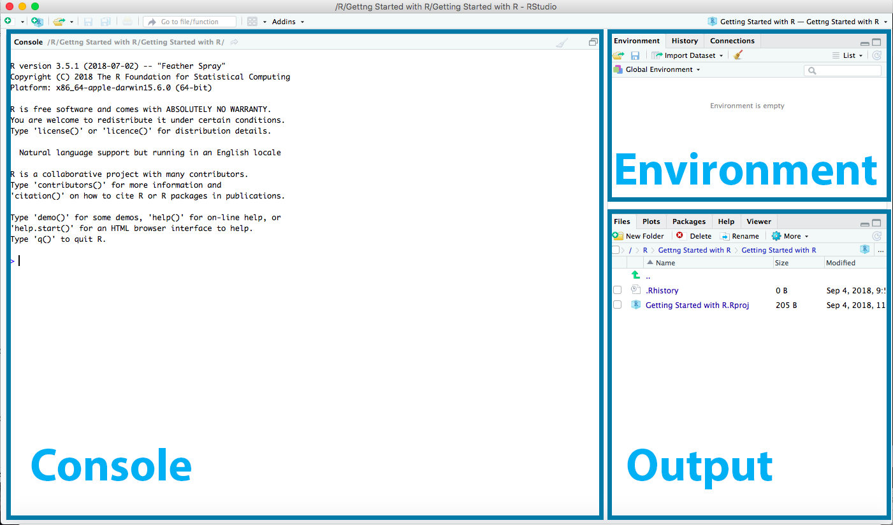
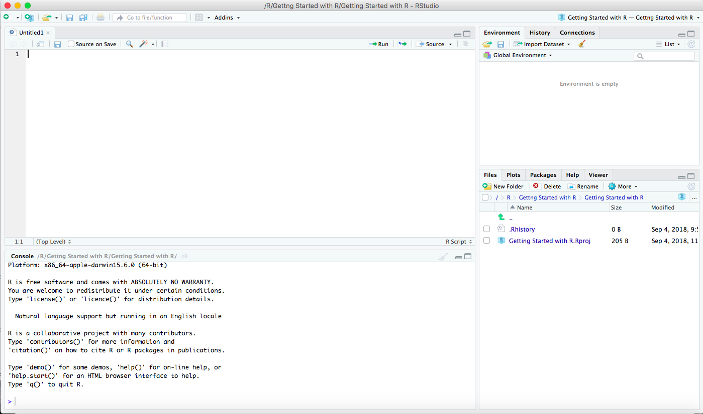

```{r setup, include=FALSE}
knitr::opts_chunk$set(echo = false)
```


# Getting started With reproducible Antarctic Data Science {#intro}
Before getting started  with the R tools we start with a brief overview of the basics.
This overview is meant to get you going so th information provide is by no means meant to be exhaustive, links to additional information and resources can be found in the links.

To get started you will need to install R and R studio. 
After that we'll introduce you to Markdown and Rmarkdown. This is great for keeping your code organised. It is easy to learn and will save you lots of time in the future.
Finally we'll introduce you to two R ecosystems of data packages that lower barriers to working with scientific data sources on the web: tidyverse and the ropensci.

Having completed this introduction should allow you to make the most use of the various tools available through www.github.org/SCAR

## What is R
R is a free software environment for statistical computing and graphics. It compiles and runs on a wide variety of UNIX platforms, Windows and MacOS. R is available through CRAN, the comprehensive R archive network.

#### Installation - R
To dowload R go to cloud mirror, https://cloud.r-project.org, which will sellect the clostest mirror server to download R.

### What is R Studio
RStudio is an integrated development environment (IDE) for R. It includes a console, syntax-highlighting editor that supports direct code execution, as well as tools for plotting, history, debugging and workspace management. 

#### Installation - R Studio
To Download and install R studio go to http://www.rstudio.com/download. At this point you need to install the Desktop version for your computer.

If you open R studio you will see 3 panels. 

```{r rstudio-fig, echo=FALSE, fig.cap="R studio startup window", fig.align='center'}
library(knitr)

```

**(Bottom) left:** Console Panel. Here you can type in R code and let it run. Figure\@ref(fig:rstudio-fig)

**Bottom right:** Output Panel. Here you can see some of the output of your code: files, plots and help 

**Top Right:** environment and history

```{r rscript-fig, echo=FALSE, fig.cap="R studio with R script panel", fig.align='center'}
library(knitr)

```

Later you will add a 4th panel in the **top left**: the editor where you can edit R script or R markdown documents.

## What is R markdown

This is an R Markdown document. Markdown is a simple formatting syntax for authoring HTML, PDF, and MS Word documents. For more details on using R Markdown see <http://rmarkdown.rstudio.com>.
Using R markdown allows Markdown is a great choice for getting started with reproducible research. R Markdown: An enhanced flavor of Markdown that recognizes R code chunks, which allows the embedding of R directly into a Markdown document to create dynamic and reproducible documents.

## What are R packages
In order to work with R you'll have to insitall R packages. an R packages is a collection of functions, data, and documentation that extends the capabilities of base R. Installing and using packages will allow yo to take adavatage of R in the largest extent possible.

Installing a packages requires a single line of code

```
install.packages("package_name")
```
Where Package_name is the name of the package.
After installing the package you still need to load the package in order to use the functions, objects, and help files contained in the package. 
```
library("package_name")
```

These command only work for packages that have been published on CRAN
```
install.packages("devtools")
devtools::install_github("package_location_github")
```

```
install.packages("devtools")
devtools::install_github("ropensci/rgbif")
```

## RopenSci
rOpenSci is a non-profit initiative that wants to make scientific data retrieval reproducible. rOpenSci had developed an ecosystem of open source tools, runs annual unconferences, and reviews community developed software.
www.ropensci.org


## Tidyverse

The tidyverse is an opinionated collection of R packages designed for data science. All packages share an underlying design philosophy, grammar, and data structures. 

www.tidyverse.org


Install the complete tidyverse with:

```
install.packages("tidyverse")
```


